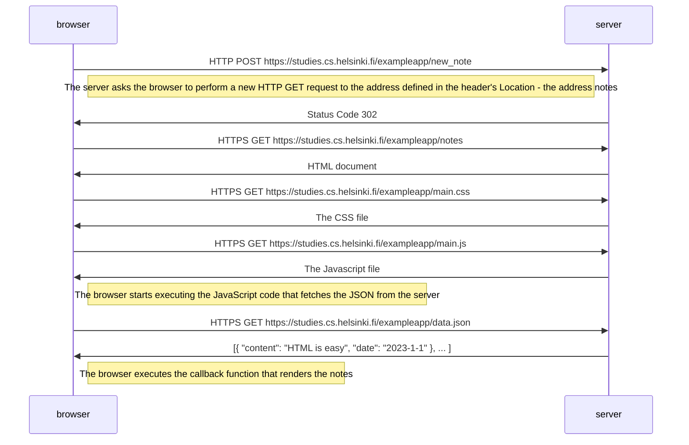

```mermaid

sequenceDiagram

browser->>server: HTTP POST https://studies.cs.helsinki.fi/exampleapp/new_note

Note left of server: The server asks the browser to perform a new HTTP GET request to the address defined in the header's Location - the address notes

server->>browser: Status Code 302

browser->>server: HTTPS GET https://studies.cs.helsinki.fi/exampleapp/notes

server->>browser: HTML document

browser->>server: HTTPS GET https://studies.cs.helsinki.fi/exampleapp/main.css

server->>browser: The CSS file

browser->>server: HTTPS GET https://studies.cs.helsinki.fi/exampleapp/main.js

server->>browser: The Javascript file

Note right of browser: The browser starts executing the JavaScript code that fetches the JSON from the server

browser->>server: HTTPS GET https://studies.cs.helsinki.fi/exampleapp/data.json

server->>browser: [{ "content": "HTML is easy", "date": "2023-1-1" }, ... ]

Note right of browser: The browser executes the callback function that renders the notes

```
